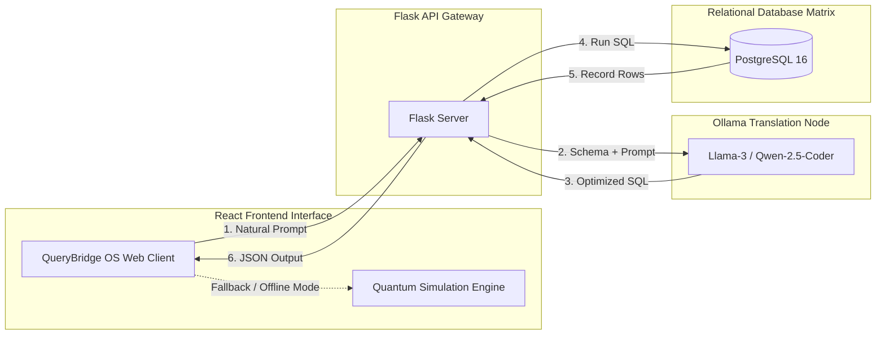

# 🌌 QueryBridge: AI-Powered Natural Language SQL Engine

<div align="center">
  
  <p><strong>Translating Human Thought into Optimized Database Queries</strong></p>

  [](https://vite.dev/)
  [](https://react.dev/)
  [](https://tailwindcss.com/)
  [](https://ollama.com/)
  [](https://flask.palletsprojects.com/)
  [](https://www.postgresql.org/)
</div>

---

## ⚡ Introduction

**QueryBridge** is an experimental prototype designed to bridge the friction gap between human expression and complex structured database queries. In traditional environments, extracting records requires writing syntax-perfect SQL code. QueryBridge converts colloquial sentences directly into optimized SQL scripts in milliseconds.

Featuring a beautiful, glassmorphic **QueryBridge OS** interface, users can query their databases using either direct keyboard prompts or **voice command recognition (Speech-to-Text)**. 

If the backend database or AI service is offline, QueryBridge transitions seamlessly into **Quantum Simulation Engine** mode, providing fully functional simulated queries so you can showcase the interface standalone anywhere, anytime.


## 🚀 Key Features

*   **🧠 Intelligent Prompt Translation:** Instantly converts natural language questions (e.g., *"Show top 5 sold products in 2025"*) into optimized ANSI SQL queries.
*   **🎙️ Speech-to-Text Input Protocol:** Directly speak your questions into the terminal via integrated speech recognition.
*   **🖥️ Real-time AST Compilation Console:** Visualizes compiling and parsing stages with live, terminal-styled logs.
*   **📊 Relational Output Buffer:** Renders tabular results with column highlighting, formatting of statuses/emails, and **instant CSV export**.
*   **📝 Historical AST Log Preservation:** Stores past translations locally so you can copy the SQL code, review performance diagnostic stats, or **rerun queries** with a single click.
*   **🔌 Dual Execution Architecture:** Route queries to a live backend endpoint or fall back to high-fidelity simulated responses.
*   **✨ Immersive Aesthetics:** Built using modern glassmorphism, HSL custom palettes, canvas-based floating star particle physics with mouse deflection, and smooth Framer Motion micro-animations.

---

## 🏗️ Architecture & Technology Stack

The QueryBridge ecosystem connects the following components:



### Stack Details
1.  **Frontend (React 19 & Vite):** Powers the user interfaces, handles zero-gravity coordinate physics, and renders AST compiling states.
2.  **API Bridge (Flask Server):** Validates input syntax, handles request headers, and proxies calls to local LLM inference engines.
3.  **SQL Translation Node (Ollama AI Core):** Leverages offline local LLMs (e.g., `Llama-3`, `Qwen-2.5-Coder`) to translate human questions into syntax-perfect SQL.
4.  **Database Layer (PostgreSQL 16):** Stores datasets, indexes records, and executes compiled SQL statements.

---

## 📊 Database Schema Blueprint

The application is calibrated to translate queries matching the following default database schema layout:

| Table Name | Description | Column Details |
| :--- | :--- | :--- |
| **`users`** | Customer records | `id (PK)`, `name`, `email`, `state`, `created_at` |
| **`products`** | Merchandise catalogs | `product_id (PK)`, `name`, `price`, `category` |
| **`orders`** | Purchase history transactions | `order_id (PK)`, `user_id (FK)`, `order_date`, `total_amount`, `status` |
| **`order_items`** | Items in each order | `item_id (PK)`, `order_id (FK)`, `product_id (FK)`, `quantity`, `total_price` |

### Example Queries to Try:
*   *"Show all users from California"*
*   *"Find top 10 products sold in 2025"*
*   *"Get average revenue per month"*
*   *"List orders with status processing"*

---

## ⚙️ Getting Started

### Prerequisites

Make sure you have the following installed on your machine:
*   [Node.js](https://nodejs.org/) (v18.x or higher)
*   [npm](https://www.npmjs.com/)
*   *(Optional for Live Mode)* [Ollama](https://ollama.com/) with a model (e.g., `llama3` or `qwen2.5-coder`)
*   *(Optional for Live Mode)* [PostgreSQL](https://www.postgresql.org/) & [Python 3](https://www.python.org/) with Flask

### Installation

1.  Clone the repository:
    ```bash
    git clone https://github.com/yourusername/QueryBridge.git
    cd QueryBridge
    ```

2.  Install frontend dependencies:
    ```bash
    npm install
    ```

3.  Start the local development server:
    ```bash
    npm run dev
    ```

4.  Open the web client at the port printed by Vite (typically `http://localhost:5173`).

---

## 🔧 Configuring the Live API Backend

By default, the client runs in **Quantum Simulation Mode** so it functions out of the box with mock datasets. To bind it to your real database:

1.  Run your Flask backend server on `http://localhost:5000` (or your custom port).
2.  Open the QueryBridge application in your browser.
3.  Click the **Gear Icon (Settings)** in the top-right corner of the Navbar.
4.  Update the **AI Bridge Endpoint URL** (e.g., `http://localhost:5000/api`) and click **Apply Configuration**.
5.  The system status will transition to **LIVE CORE** if the client successfully contacts the backend!

---

## 🔮 Future Enhancements

-   [ ] **Schema Autodetect:** Drag-and-drop a `.sql` schema file to automatically calibrate the AI model's SQL prompt builder.
-   [ ] **Model Switching:** Swap translation models (e.g., Llama-3, DeepSeek-Coder, GPT-4o) directly from the settings drawer.
-   [ ] **Multi-Dialect Compiling:** Support generating queries for SQLite, MySQL, and Microsoft SQL Server.
-   [ ] **Explain Plan Visualization:** Interactive nodes showing how Postgres execution plans query paths.

---

## 📄 License

This project is licensed under the MIT License - see the [LICENSE](LICENSE) file for details.

---

<div align="center">
  <sub>Built with ❤️ by the QueryBridge Engineering Crew. All protocols enforced.</sub>
</div>
